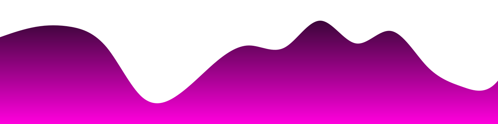
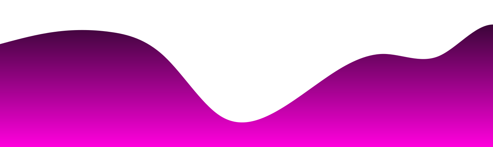

 

  

 🚀  My Ultimate Goal is to learn & make "Optimized self-built code, universally readable".

 

<h2 align="center">About me</h2>

⚬ Currently doing projects with ReactJS and Nextjs 14.

⚬ Learning & practicing Data Structures and Algorithms.

⚬ Improving everyday to be a Senior Engineer.

 

<h2 align="center">⚡️ WIP</h2>

  <a href="https://github.com/thanhhoann/piz">piz</a>&nbsp;An experimental social media platform. (<a href="https://piz-docs.vercel.app/">Piz's Documentation</a>)

  <a href="https://github.com/thanhhoann/algo_visualizer">algo_visual</a>&nbsp;A website of hand-crafted data structures & algorithms visualizers.

  <a href="https://github.com/thanhhoann/PokeBuy">pokebuy</a>&nbsp;A Pokémon Card store.
 

  <a href="https://github.com/thanhhoann/notes">sticky_notes</a>&nbsp;A personalized sticky notes app.

  <a href="#">thanhhoann_ui</a>&nbsp;A UI library provides copy & paste TailwindCSS components with best practices.

 

  <h2>Here is my streak</h2>
   

 

<h2 align="center">My current teck stack</h2>

    <h3>Working environment</h3>
    
    
    
    <h3>Languages</h3>
      
      
      
      
      
      
      
      
    <h3>Frameworks & Libraries</h3>
    
    
    
    
    
    
  <h3>Databases & ORMs</h3>
    
    
    
    
    
    
    
  <h3>UI Libraries</h3>
    
    
    
    
  <h3>Design Tools</h3>
    
    
  <h3>Competitive Programming</h3>
    
    
    
  <h3>Development Tools</h3>
    
    
  <h3>Currently exploring</h3>
    
    

 

<!--START_SECTION:activity-->
1. 💪 Opened PR [#151](https://github.com/thanhhoann/PokeBuy/pull/151) in [thanhhoann/PokeBuy](https://github.com/thanhhoann/PokeBuy)
<!--END_SECTION:activity-->
